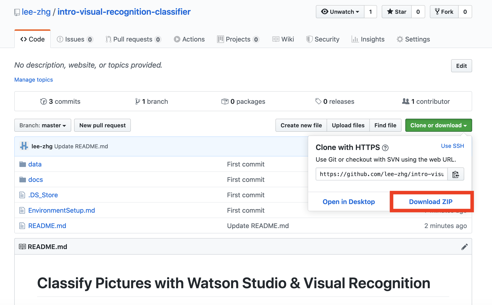

# Classify Pictures with Watson Visual Recognition and Watson Studio

The IBM Watson™ Visual Recognition service uses deep learning algorithms to analyze images for scenes, objects, and other content. A set of built-in models provides highly accurate results without training to analyze images for objects, colors, food, explicit content and other subjects for insights into your visual content.

* General model - Default classification from thousands of classes.
* Explicit model - Whether an image is inappropriate for general use.
* Food model - Specifically for images of food items.

Watson Visual Recognition makes it easy to extract thousands of labels from your images and detect for specific content out-of-the-box. In acdition to the pre-built models, you can also build custom models to detect for specific content in images inside your applications.

In this workshop, you learn how to

* classify photos with the pre-built models
* build new classification model


## Sample Use Cases

The Visual Recognition can be used for diverse applications and industries, such as:

* Manufacturing - Use images from a manufacturing setting to make sure products are being positioned correctly on an assembly line
* Visual auditing - Look for visual compliance or deterioration in a fleet of trucks, planes, or windmills out in the field, train custom models to understand what defects look like
* Insurance - Rapidly process claims by using images to classify claims into different categories


## Objectives

After completing this workshop, you should be able to:

* build a custom image classification model by using the Watson Studio and Visual Recognition
* classify photos with your custom model
* call your custom model via the Watson Visual Recognition APIs to classify photos
* classify photos with built-in models in the Watson Visual Recognition service


## Tools Used

* Watson Studio - Watson Studio is a powerful AI/Machine Learning development platform with many capabilities. It's used to create a custom visual classification model in this workshop.
* Watson Visual Recognition - Visual Recognition understands the contents of images - tag images, find human faces, approximate age and gender, and find similar images in a collection.


## Requirements

* IBM Cloud account - [sign up](https://cloud.ibm.com/registration/) if you don't have an account yet.


## Workshop Flow

The rest of this `README` provide the workshop instructions.


### Prerequisites

1. Ensure you have access to a `Waston Studio` instance and `Visual Recognition` instance. If you need to provision either instance, see the instructions in the [Setup Watson Studio & Visual Recognition document](EnvironmentSetup.md)

1. Clone this repository on your local computer.

    * If you have GIT on your machine, clone this repository locally. Open a terminal and run:

        ```
        $ git clone https://github.com/lee-zhg/intro-visual-recognition-classifier.git
        ```

    * If you do NOT have GIT on your machine, you can just download the repository as a ZIP file. In the browser window, select :

        


### Setting up Watson Studio for first time

Watson Studio is a cloud based development and deployment environment for Machine Learning, Deep Learning, Data Governance and Data Expolaration. A platform build for business analyst, data engineer, data scientist and developer to simply there task with an intuitive UI and provide massive computing power. A platform where insights can be traced back to models, projects, notebooks and data sources and where model can evolve and automatically update themselves.

* Navigate to [datascience.ibm.com](https://www.ibm.com/cloud/watson-studio)


* Sign in on the IBM Cloud

### Get Started on Watson Studio

* Click on **Get Started** and you will be redirected to the Watson Studio dashboard.

* An interactive menu will be shown **Get started with key tasks**.

### Create Project

* Click on New Project and select **Watson Tools**.


* On selecting **Watson Tools** project tile, two services i.e **Object Storage** and **Watson Visual Recognition** will be created in your IBM cloud dashboard.

* Enter **Project Name**, **details** (optional), choosing **Restrict who can be a collaborator** (optional). Notice on the side that **Object Storage** and **Watson Visual Recognition** services are selected.


* If by some error in the server they are not created, they can be added from the drop-down list too via Watson Studio.
* Project dashboard will be shown. That will have tabs like **Overview**, **Assets**, **Bookmarks**, **Access Control**, **Settings**.
* Select the **Assets** tab.


### Add data asset

* Click on **New data asset**.
* A side navigation drawer will open with **Load** tab selected.


* Click on **browse** or simply **drag and drop** the data assets of your project.
    (Note:- In case of Watson Visual Recognition project, have your data assets in a zip file).


### Create a Model

* Click on **New Visual Recognition model**.


* New dashboard will open with model names as **Default Custom Model**. Dashboard will show two tabs **My Classes** and **All Images**.
* In the **My Classes** tab click on **Create a class** and create a class you want to classify. (Note:- class of an image, it relates to the object classification task).


* Click on the created **class** and add the data asset to it by selected the data asset and clicking on **Add to model**.


* Once data assets have been added to the respective classes click on **Train Model** button.


* Process will take around 10-15 min to train the model for respective classes.


### Test Model

* Once the traning is complete click on **here** in the snakbar.


* A new dashboard will open having three tabs

1. **Overview**
2. **Test**
3. **Implementation**

* Click on the **Test** tab.


* Take a test image from any source and click on **browse** or simply **drag and drop** the image on to the dashboard.
* After loading the image into image classifier, it run the image classification algorithm which returns the accuracy within the range from 0 to 1 that identifies your class or object.


### Building the client side application (Android App).

* Start **Android Studio** and create a **new project**.


* Go back to your model in watson studio and click on **Implementation** tab.
* Under the **Implementation** tab look for Java on the left hand side navigation drawer and select it. You will find the code required to communicate with the model.


* In Android Studio under **Gradle Scripts/build.gradle (Module:app)**. Add ```implementation 'com.ibm.watson.developer_cloud:java-sdk:5.5.0'``` in the **dependencies block** and click on **Sync Now**.

* After the sync process is complete, go to **MainActivity** under the **java/package_name.project_name/** and add two global object
1. VisualRecognition
2. CameraHelper

```
VisualRecognition mVisualRecognition;
CameraHelper mCameraHelper;
```
* Under the **onCreate** method in Main Activity, initialize the objects.

```
mVisualRecognition = new VisualRecognition("{version}");
mVisualRecognition.setApiKey(api_key);

mCameraHelper = new CameraHelper(this);
```
* Once the above parts are done, under **onActivityResult** method create a background thread for making the network call, parsing the result and displaying the result to the UI.

```
    @Override
    protected void onActivityResult(int requestCode, int resultCode, Intent data) {
        super.onActivityResult(requestCode, resultCode, data);

        if (requestCode == CameraHelper.REQUEST_IMAGE_CAPTURE) {
            final Bitmap photo = mCameraHelper.getBitmap(resultCode);
            final File photoFile = mCameraHelper.getFile(resultCode);
            ImageView preview = findViewById(R.id.img_view_main);
            preview.setImageBitmap(photo);

            AsyncTask.execute(new Runnable() {
                @Override
                public void run() {
                    InputStream imagesStream = null;
                    try {
                        imagesStream = new FileInputStream(photoFile);
                    } catch (FileNotFoundException e) {
                        e.printStackTrace();
                    }
                    ClassifyOptions classifyOptions = new ClassifyOptions.Builder()
                            .imagesFile(imagesStream)
                            .imagesFilename(photoFile.getName())
                            .threshold((float) 0.6)
                            .owners(Arrays.asList("me"))
                            .build();
                    ClassifiedImages result = mVisualRecognition.classify(classifyOptions).execute();
                    Gson gson = new Gson();
                    String json = gson.toJson(result);
                    String name = null;
                    try {
                        JSONObject jsonObject = new JSONObject(json);
                        JSONArray jsonArray = jsonObject.getJSONArray("images");
                        JSONObject jsonObject1 = jsonArray.getJSONObject(0);
                        JSONArray jsonArray1 = jsonObject1.getJSONArray("classifiers");
                        JSONObject jsonObject2 = jsonArray1.getJSONObject(0);
                        JSONArray jsonArray2 = jsonObject2.getJSONArray("classes");
                        JSONObject jsonObject3 = jsonArray2.getJSONObject(0);
                        name = jsonObject3.getString("class");
                    } catch (JSONException e) {
                        e.printStackTrace();
                    }
                    final String finalName = name;
                    runOnUiThread(new Runnable() {
                        @Override
                        public void run() {
                            TextView detectedObjects = findViewById(R.id.text_view_main);
                            detectedObjects.setText(finalName);
                            detectedObjects.setOnClickListener(new View.OnClickListener() {
                                @Override
                                public void onClick(View v) {
                                    startActivity(new Intent(MainActivity.this, RecommendationActivity.class));
                                }
                            });
                        }
                    });
                }
            });

        }
    }
```

Congratulations! Now you have an android application communicating with the model built and deployed on Watson Studio.

Link to the [Github Repo](https://github.com/sudoalgorithm/Developing-A-Image-Classifier-Using-Watson-Visual-Recognition-On-Watson-Studio-Android-App) contining the android code.

## Summary

In this how-to we learned how to build a image classification model using Watson Tool project on Watson Studio and then use the model to build and android application.


