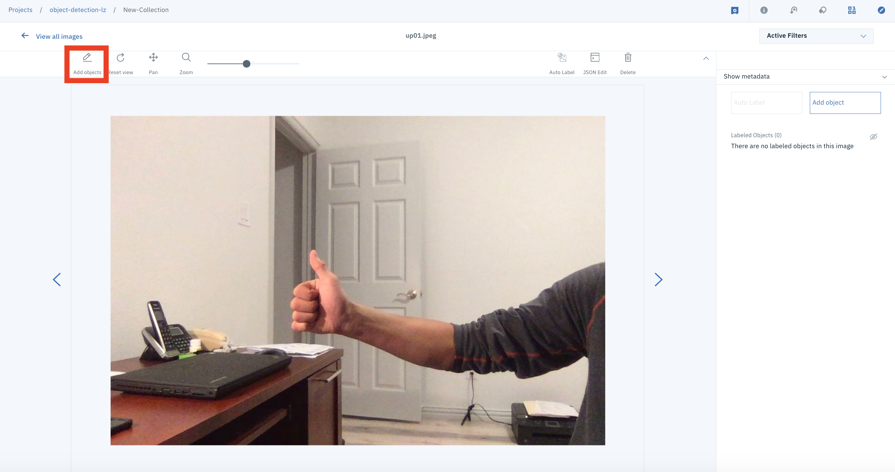
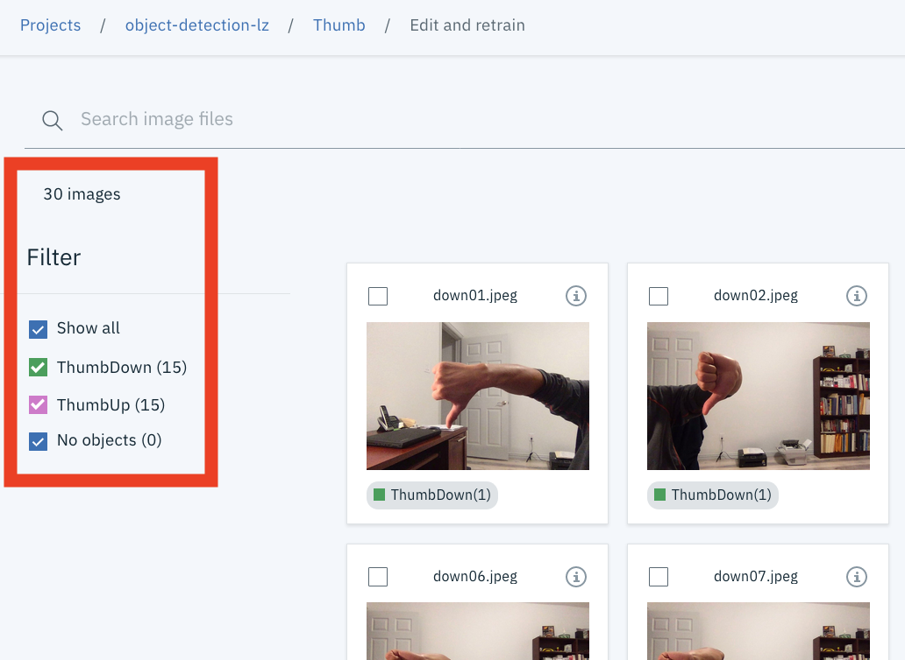

# Detect Objects in Image with Watson Studio & Visual Recognition

The IBM Watson™ Visual Recognition service uses deep learning algorithms to analyze images for scenes, objects, and other content. IBM Watson™ Visual Recognition Custom Object Detection identifies items and their location in an image. The service detects these items based on a set of images with labeled training data that you provide.

You train the object detection model to recognize objects that are important to your workflow or domain. For example, detect damage to cars, find machines that need maintenance, or inspect items in the field. You can also use object detection to count objects or manage inventory.

Classification and object detection are similar but have different uses. In general, if you want to predict the existence of objects in an image, use classification. If you want to locate or count objects in an image, use object detection.


## Objectives

After completing this workshop, you should be able to:

* build a custom object detection model by using the Watson Studio and Visual Recognition
* detect objects in image with your custom model
* call your custom model via the Watson Visual Recognition APIs to detect object


## Tools Used

* Watson Studio - Watson Studio is a powerful AI/Machine Learning development platform with many capabilities. It's used to create a custom visual classification model in this workshop.
* Watson Visual Recognition - Visual Recognition understands the contents of images - tag images, find human faces, approximate age and gender, and find similar images in a collection.


## Requirements

* IBM Cloud account - [sign up](https://cloud.ibm.com/registration/) if you don't have an account yet.


## Workshop Flow

The rest of this `README` provide the workshop instructions.


### Prerequisites

1. Ensure you have access to a `Waston Studio` instance and `Visual Recognition` instance. If you need to provision either instance, see the instructions in the [Setup Watson Studio & Visual Recognition document](EnvironmentSetup.md)

1. Clone this repository on your local computer.

    * If you have GIT on your machine, clone this repository locally. Open a terminal and run:

        ```
        $ git clone https://github.com/lee-zhg/intro-visual-recognition-object-detection.git
        ```

    * If you do NOT have GIT on your machine, you can just download the repository as a ZIP file. In the browser window, select :

        


### Setup Project in Watson Studio

1. Start Watson Studio by logging in at [https://dataplatform.ibm.com](https://dataplatform.ibm.com)

1. From the dashboard page, Click the **`Create a project`** link to create a new project in Watson Studio.

    

1. Select option `Select an empty project`.

1. Give your project a name and click **`Create`** on the bottom right.

    

1. Next you have to associate a `Visual Recognition` service to the project. 

1. Select on `Settings` tab on the top banner of the project.

1. Click the `Add Service` link under `Associate Services`.

1. Select `Watson` to add a Watson service to the project.

    

1. Select `Visual Recognition` from the list of available Watson Services.

    

1. Select the `Existing` tab and select the name of your `Visual Recognition` service instance.

    
  
1. Click `Select`.

1. The `Visual Recognition` service is now listed as one of your `Associated Services`.

    


### Add Data Assets

To add tarining photos to the `Waston Studio` project as `data assets`, 

1. Navigate the `Assets` tab on the top.

    

1. Click `Add to project` button on the top.

1. Select `Data` tile.

    

1. The `Load-Files-Catalog` window is displayed at the top-right corner.

    

1. Click `browse` link to upload the following files
    * data/ThumbUp.zip
    * data/ThumbDown.zip

1. You have to load file one at a time. You have two data assets ready to build your custom model after you completed the loading.

    


### Create a Custom Visual Recognition Object Detection Model

To create a custom visual recognition object detection model,

1. Navigate to `Assets` tab within your `Watson Studio` project.

1. Click `Add to project` button on the top.

1. Select `Visual Recognition` tile.

    

1. Click `Create Model +  ` link on the `Detect Objects` tile.

    

1. Rename `New-Collection` to `ThumbUp`.

    

1. `Apply`.

1. `Data Assets` uploaded in the previous section are available on the right.

1. Add file `ThumbUp.zip`.

    a) Select file `ThumbUp.zip` on the right and drop the center of the canvas. This makes the photos available for training the custom object detection model.

    

    b) Click picture `up01.jpeg` to open it.

    

    c) Click `Add Objects` icon  on the top-left. This enable you to draw box around the object that ypu intend to detect via the model.

    d) Draw a box around the hand in the picture.

    

    e) Enter `ThumbUp` as the `Object label`.

    f) Click `Add`. Now, you identified the `ThumbUp` hand in the picture `up01.jpeg` as the object to detect. This is everything you have to do for the picture `up01.jpeg`.

    g) Click `>` to the right of the picture `up01.jpeg`. Now, the next picture should be displayed.

    h) Repeat the same process for the remaining pictures
    * draw box around the `ThumbUp` hand
    * add `ThumbUp` label

    i) After you processed all `ThumbUp` pictures, click `Done` button.

1. Click `View all images` link.

    

1. Add file `ThumbDown.zip`

    a) Select file `ThumbDown.zip` on the right and drop the center of the canvas. 

    b) Click picture `down01.jpeg` to open it.

    c) Click `Add Objects` icon  on the top-left. This enable you to draw box around the object that ypu intend to detect via the model.

    d) Draw a box around the hand in the picture.

    e) Enter `ThumbDown` as the `Object label`.

    f) Click `Add`. Now, you identified the `ThumbDown` hand in the picture `down01.jpeg` as the object to detect. This is everything you have to do for the picture `down01.jpeg`.

    g) Click `>` to the right of the picture `down01.jpeg`. Now, the next picture should be displayed.

    h) Repeat the same process for the remaining pictures
    * draw box around the `ThumbDown` hand
    * add `ThumbDown` label

    i) After you processed all `ThumbDown` pictures, click `Done` button.

    > Note: you don't need to process `ThumbUp` images again.

1. Click the `View all images` link.

1. You can review all images on this page.

    

1. If you did everything correctly, you should have

    * totally 30 images
    * 15 of them are `ThumbUp`
    * 15 of them are `ThumbDown`

1. Click the `Train Model` button on the top-right. The training may take a few minutes.

    

1. The training process may take a few minutes. After the model training is completed, message `Training successful: Your model training was successful. Click here to view and test your model.` is displayed  on the top of your window.

    


### Test Custom Model

To test your custom model,

1. You may click the `here` link in the above message to go to test and see the detail information of the custom model.

    

1. Take note of `Model ID` which will be needed for the remaining of the workshop.

1. Select the `Test` tab.

1. Select or drag/drop testing image file `data/ThumbUp-test.jpeg` to the canvas.

1. The custom model detects the `ThumbUp` hand in the image.

    

1. `Threshold` slider is available on the left. It can help filter out the detected objects with low confidence.

1. The testing image file `data/ThumbDown-test.jpeg` is also available.

1. Navigate to the `Implementation` tab. Code snippets of calling the model via APIs are provided.

    

1. Accessing the custom model via APIs will be discussed in detail in the remaining of the workshop.


### Retrieve apikey of Visual Recognition

To retrieve `apikey` of your `Visual Recognition` service instance,

1. Navigate to the `IBM Cloud Resource List` at https://cloud.ibm.com/resources.

1. Expand `Servives` section.

1. Select your `Visual Recognition` instance.

1. Select the `Service credentials` in the left pane.

1. There should be at least one `Service Credential` defined on the right. In case there is no `Service Credential` defined, click `New credential` button and take all default to create one.

1. Click `View credential` link of any `credential` instance and expand it.

1. Take note of `apikey` and `url` property. They'll be used for the remaining of the workshop.


### Access Custom Model APIs via Curl

To call your custom model API via `Curl`,

1. Open a command window or terminal.

1. Navigate to the folder where this repo was downloaded.

    ```
    cd <PATH>/intro-visual-recognition-object-detection
    ```

1. Classify an image via POST API

    ```
    curl -X POST -u "apikey:{apikey}" -F "features=objects" -F "collection_ids=50269437-a198-47eb-b29d-b63f3eac6b01" -F "images_file=@<PATH of your downloaded repo folder>/intro-visual-recognition-object-detection/data/ThumbUp-test.jpeg" -F "images_file=@<PATH of your downloaded repo folder>/intro-visual-recognition-object-detection/data/ThumbDown-test.jpeg" "https://gateway.watsonplatform.net/visual-recognition/api/v4/analyze?version=2019-02-11"
    ```

    >Note: Replace `{apikey}` with the `apikey` of your `Visual Recognition` instance.

    > Note: `50269437-a198-47eb-b29d-b63f3eac6b01` is the custom model ID. Replace it with your custom model ID which can be found on the `Overview` tab of your custom model.

    >Note: `<PATH of your downloaded repo folder>/intro-visual-recognition-object-detection/data/ThumbUp-test.jpeg` and `<PATH of your downloaded repo folder>/intro-visual-recognition-object-detection/data/ThumbDown-test.jpeg` are the testing images on your local machine. They are part of this repo and should have been downloaded to your machine.

1. The REST API call returns the object detection result below. The JSON object includes the the object class, size and location of the detected objects as well as the meta data and size of the image.

    ```
    {
        "images": [
            {
                "source": {
                    "type": "file",
                    "filename": "ThumbDown-test.jpeg"
                },
                "dimensions": {
                    "height": 720,
                    "width": 1080
                },
                "objects": {
                    "collections": [
                        {
                            "collection_id": "50269437-a198-47eb-b29d-b63f3eac6b01",
                            "objects": [
                                {
                                    "object": "ThumbDown",
                                    "location": {
                                        "left": 420,
                                        "top": 177,
                                        "width": 193,
                                        "height": 357
                                    },
                                    "score": 0.8298379
                                }
                            ]
                        }
                    ]
                }
            },
            {
                "source": {
                    "type": "file",
                    "filename": "ThumbUp-test.jpeg"
                },
                "dimensions": {
                    "height": 720,
                    "width": 1080
                },
                "objects": {
                    "collections": [
                        {
                            "collection_id": "50269437-a198-47eb-b29d-b63f3eac6b01",
                            "objects": [
                                {
                                    "object": "ThumbUp",
                                    "location": {
                                        "left": 606,
                                        "top": 280,
                                        "width": 240,
                                        "height": 352
                                    },
                                    "score": 0.750545
                                }
                            ]
                        }
                    ]
                }
            }
        ]
    }
    ```


### Access Custom Model APIs via Node.js

To call your custom model API in `Node.js` application,

1. Open file `app.js` in your favor file editor. File `app.js` locates  in the root folder of your downloaded repo directory.

1. Modify the following three lines.

    ```
    apikey: '{apikey}'
    url: '{url}',
    collectionIds: ['{model_id}'],
    ```

    > Note: Replace `{apikey}` with the `apikey` of your `Visual Recognition` instance that you retrieved in the previous section.

    > Note: Replace `{url}` with the `url` of your `Visual Recognition` instance that you retrieved in the previous section..

    > Note: Replace `{model_id}` with your custom model ID. It can be found on the `Overview` tab of your custom model. 
    
1. Save  the changes.

1. Download required libraries.

    ```
    npm install
    ```

1. Run the sample application.

    ```
    node app.js
    ```

1. The sample application detects `ThumbUp` and `ThumbDown` object as below. The JSON object includes the the object class, size and location of the detected objects as well as the meta data and size of the image.

    ```
    {
      "images": [
        {
          "source": {
            "type": "file",
            "filename": "ThumbDown-test.jpeg"
          },
          "dimensions": {
            "height": 720,
            "width": 1080
          },
          "objects": {
            "collections": [
              {
                "collection_id": "50269437-a198-47eb-b29d-b63f3eac6b01",
                "objects": [
                  {
                    "object": "ThumbDown",
                    "location": {
                      "left": 420,
                      "top": 177,
                      "width": 193,
                      "height": 357
                    },
                    "score": 0.8298379
                  }
                ]
              }
            ]
          }
        },
        {
          "source": {
            "type": "file",
            "filename": "ThumbUp-test.jpeg"
          },
          "dimensions": {
            "height": 720,
            "width": 1080
          },
          "objects": {
            "collections": [
              {
                "collection_id": "50269437-a198-47eb-b29d-b63f3eac6b01",
                "objects": [
                  {
                    "object": "ThumbUp",
                    "location": {
                      "left": 606,
                      "top": 280,
                      "width": 240,
                      "height": 352
                    },
                    "score": 0.750545
                  }
                ]
              }
            ]
          }
        }
      ]
    }
    ```


## Build Mobile Application with your Custom Model

Refer to the resource/repo links below to build mobile application with a custom model.

* https://cloud-annotations.github.io/training/classification/cli/

* https://cloud-annotations.github.io/training/object-detection/cli/

* https://github.com/cloud-annotations/custom-training


